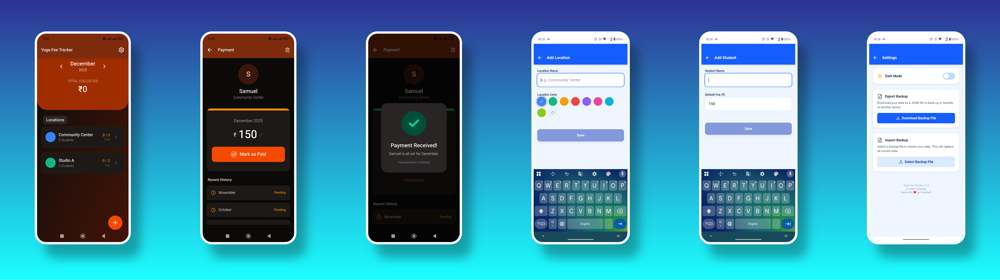

<!--
	Yoga Fee Tracker
	README autogenerated/updated by Copilot helper
-->

# Yoga Fee Tracker

<div align="center">
    
</div>

<!-- Badges (for-the-badge style) -->
<p align="left">
	
	
	
	
	
	
	
</p>

---

## Quick Overview ⚡

Yoga Fee Tracker is a small, focused app for tracking monthly fees received from students across multiple locations. It's intentionally local-first (no backend) and works as a web app and a Capacitor native shell for Android/iOS.

## Table of Contents

1. Features
2. Tech Stack
3. Screenshots
4. How to Run (local / vite)
5. How to Build (with Capacitor)
6. Data & Storage
7. Backstory / Motivation
8. Credits & Acknowledgements
9. Contributing
10. Privacy & Data Handling

---

## Features ✅

- Track students, locations, and payments (monthly fees)
- Simple export / import JSON backups
- Local-first preferences & filesystem backups via Capacitor
- Minimal UI that gets the job done (vibecoded — not a UI-first project)

## Tech Stack 🔧

- React 19 + TypeScript
- Vite (dev server & build)
- Capacitor for native builds & filesystem access
- Tailwind CSS + lucide-react for icons
- Capacitor Plugins: Preferences, Filesystem, App, safe-area

---

## Screenshots 📸


---

## How to run locally (Vite) 🧭

Prerequisites:

- Node.js (recommended >= 18)
- npm or pnpm

Start a dev server:

```powershell
npm ci
npm run dev
```

Then open your browser at http://localhost:5173 (or the printed Vite dev server URL).

Build for production (web):

```powershell
npm run build
```

Preview the production build locally:

```powershell
npm run preview
```

---

## How to build with Capacitor (Android / iOS) 📱

Prerequisites:

- Android Studio (for Android builds) & Java SDK
- Xcode (for iOS) — **macOS only**
- Capacitor CLI (bundled in devDependencies)

Sync with native platforms and open Android Studio

```powershell
npm ci
npm run build
npx cap sync
npx cap open android
```

From Android Studio you can run on an emulator or generate an APK/AAB for publishing.

For iOS (macOS only):

```bash
npm ci
npm run build
npx cap sync
npx cap open ios
```

Android Tips:

- If `npx cap sync` fails because the Android platform isn't installed, run `npx cap add android`.
- Use Android Studio's emulator or connect a device to test.

---

## Data & Storage 💾

- All data is stored locally using Capacitor Preferences (no backend) to keep your data private and offline.
- Backups are supported via the Filesystem (native) or via a JSON download in the web app.
- Data model types can be found in `types.ts` (Locations, Students, Payments).

## Backstory — why this exists ❤️

My mom runs yoga classes at multiple places and each place has multiple students. The fees for these classes is taken on a monthly basis. She used to record fees manually in a diary along with fees cards for the students. I thought that's a bit of extra work she has to do. So I vibecoded this app. This should make it easy for her to keep records.

---

## Project Structure (short) 📁

- `App.tsx`, `index.tsx` — App entry points
- `assets/` — icons and static assets
- `screenshots/` — screenshot gallery
- `services/` — business logic & data storage (see `services/storage.ts`)
- `components/` — UI components & forms
- `types.ts` — TypeScript model types for data (locations/students/payments)

---

## Credits & Acknowledgements 🙏

- Author / Maintainer: **ShambaC**
- This project was scaffolded by Gemini 3 in aistudio.
- Feature contributions were added with Claude Opus 4.5.
- Fixes and core decisions by me.
- Some refactoring was done using Raptor Mini.

> Note: This app is “mostly vibecoded” — I am not a UI person, so the UX and UI are intentionally minimal.

---

## Contributing 🤝

If you'd like to help:

- Open an issue describing the problem/idea.
- Send a PR with a small, well-described change and tests where appropriate.

If you want to run checks locally, run those commands listed in the Vite & Capacitor sections.

---

## Privacy & Data Handling 🔒

This app stores all data locally on-device. No data is sent to remote servers by default. Backups are produced as JSON files that must be explicitly exported/imported.

---

Made with ❤️ by **ShambaC** — powered by some AI help.
